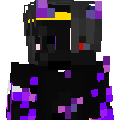

# 📌 О сервере

<mark style="color:green;">**Вступление:**</mark>

emsi - Это приватный ванильный сервер майнкрафт, который основан на интереснейшей истории, рассказывающейся через ивенты. Вход к нам стоит денег из-за отсутствия доната и для защиты от гриферов. Зайдя на сервер вы можете заняться чем угодно, красиво строить, быть у власти, стать полицейским или другим рабочим, отыгрывать ролплэй.

<mark style="color:yellow;">**Сервер представляет из себя:**</mark>

**большой майнкрафт мир на котором расположены города. Создать свой город может любой игрок, если всё подходит по требованиям.**

У нас не обязательно отыгрывать RP на все 100%, но желательно использовать эту возможность.

Вы также можете вступать в города.

#### <mark style="color:yellow;">**Игра на сервере возможна:**</mark> 

доступно с  **java** версии,  Майнкрафт.

#### <mark style="color:yellow;">**На сервере нет приватов, донатов:**</mark> 

которые влияют на игровой процесс, а так-же никаких плагинов по типу /home /set /hub и тд. От этого сервер очень цениться и проходка на него стоит денег, дабы защитить сервер от гриферов и неадекватных игроков.

**Атмосфера на сервере** - у нас царит крутейшая атмосфера, такой нет ни на одном сервере!

**Невозможно вместить** все прелести сервера сюда, поэтому я написал только краткие аспекты.

<mark style="color:yellow;">**Вопросы которые часто нам задают:**</mark>



Да, сервер подходит как для лицензионных аккаунтов, так и для пиратских.























<figure><figcaption></figcaption></figure>

Наш логотип
