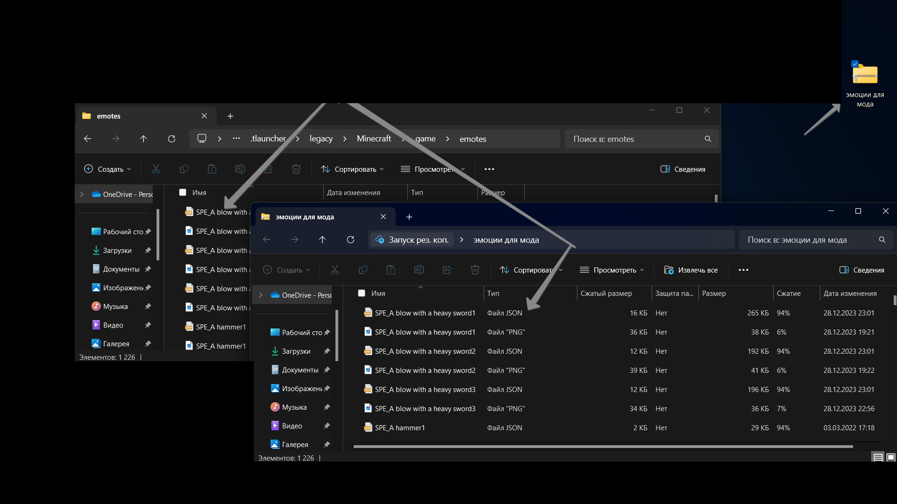

# Emotecraft&#x20;

## Emotecraft  - emotes

Как папасть в папку - C:\Users\xdfvb\AppData\Roaming.tlauncher\legacy\Minecraft\game\emotes

<mark style="color:yellow;">**Как загрузить анмимасые**</mark>

<figure><figcaption></figcaption></figure>

<figure><figcaption></figcaption></figure>

<mark style="color:green;">**Скачать**</mark> -  [<mark style="color:blue;">**Клик**</mark>](https://disk.yandex.ru/d/bHwgF\_4J2Dm61w)

<mark style="color:orange;">**Сё готова заходим на север и наслаждаемся**</mark>
