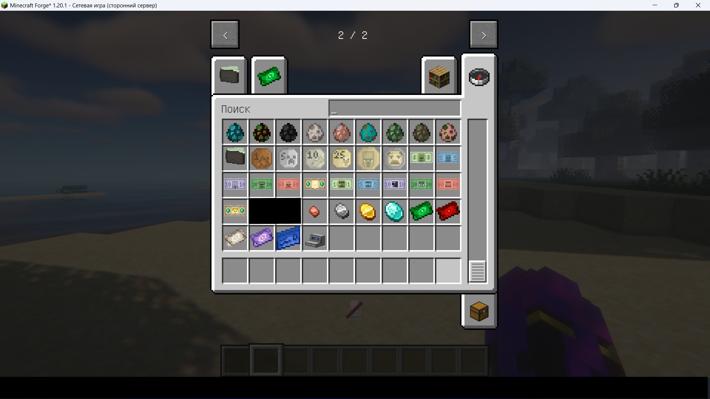

# Банк

Чтобы получить право пользоваться банком на сервере, вы должны:&#x20;

1\. Отыграть 3 часа на сервере.&#x20;

2\. Зарегистрировать счет и карту у любого действующего банкира. Для этого вам понадобится 15 ар.&#x20;

3\. Готово! **Инфо :**

Банкиром считается игрок с баджей **`$`** , а также с ролью "Банкир" на дискорд сервере.

**Для чего используется банковская карта на сервере?** - Переводы ар игрокам. - Хранение денег на счету.

**Для чего нужны банкиры?** - Открытие счета в банке. - Регистрация карты. - Оплата штрафов. - Вклады, кредиты.

<figure><figcaption></figcaption></figure>
